# Begehungsbericht

## Begehungsbericht

**Datum:** 16-08-2025  
**Untersuchungsgebiet:** Gebiet  
**Dokumententyp:** Begehungsbericht  
**Teilnehmende Personen:** P1, P2, ...

## Begehungsstatistik

- **Gesamtbilder:** 19
- **Dokumentierte Strecke:** 1.14 km (Luftlinie zwischen Aufnahmepunkten)
- **Koordinatensystem:** WGS84 (GPS)

## Methodik

Die Bildorganisation erfolgte automatisch nach dem Nearest-Neighbor-Prinzip. Ausgehend vom mit "001_" markierten Startbild wird jedes nachfolgende Bild als das geografisch nächstgelegene zum vorherigen ausgewählt. Die Entfernungsberechnung erfolgt mittels Haversine-Formel für präzise GPS-Distanzbestimmung.

## Ergebnis

Die automatische Verarbeitung der GPS-getaggten Bilder ermöglicht eine systematische und reproduzierbare Dokumentation des Wanderwegs. Alle Bilder wurden erfolgreich nach geografischer Nähe sortiert und mit entsprechenden Koordinaten versehen.

## Schlussfolgerungen

Die automatische Bildorganisation und GPS-Dokumentation ermöglicht eine objektive und reproduzierbare Erfassung von Wegverläufen. Die generierte Dokumentation dient als Grundlage für weitere Analysen und kann für Wegeplanung und -wartung verwendet werden.

# Fotodokumentation

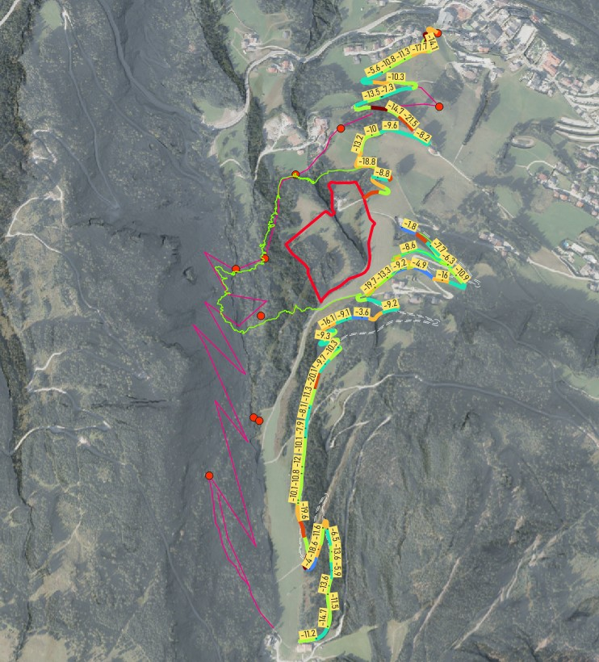
*Abb. 1: Übersicht, grün - GPX-Track, pink - Variantenvorschlag, rote Kreise - Kontrollpunkte, rotes Polygon - zu meidende Gst, rechts der Piste - Trasse AEP-Cichini*

*Abb. 2: Text, text, text, text, text, text, text, text, text, text, text, text, text, text, text, text, text, text, text, text, text, text, tex (Aufnahmezeitpunkt: 13:43, Seehöhe: 896 m)*

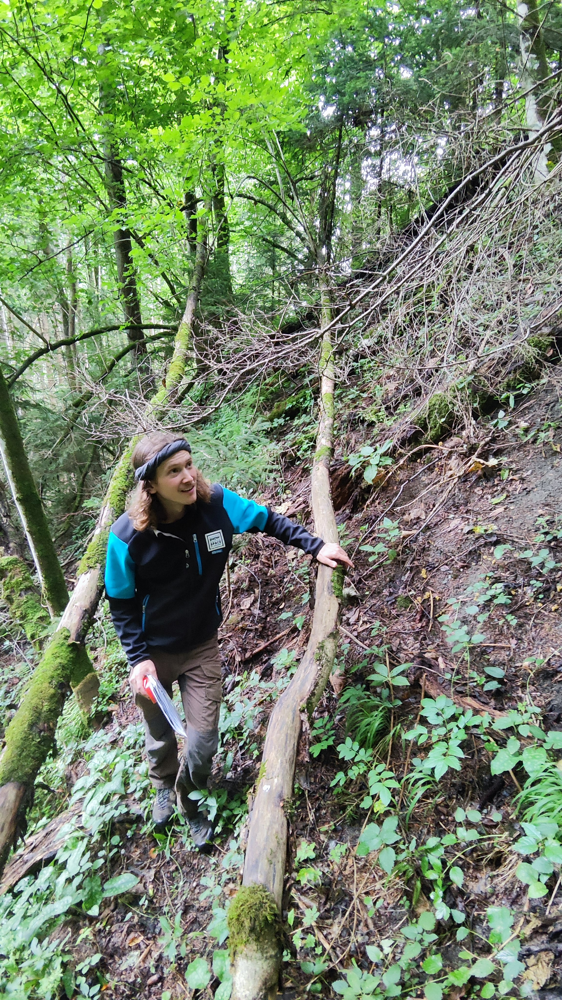
*Abb. 3: Noexif media (Aufnahmezeitpunkt: 13:44, Seehöhe: 898 m)*

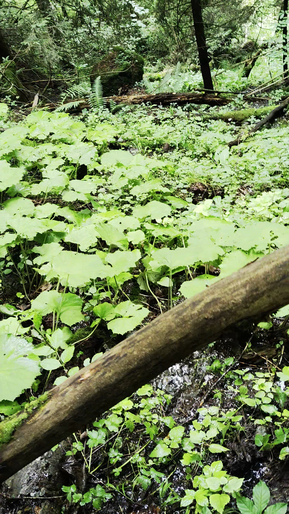
*Abb. 4: Noexif media (Aufnahmezeitpunkt: 13:45, Seehöhe: 900 m)*

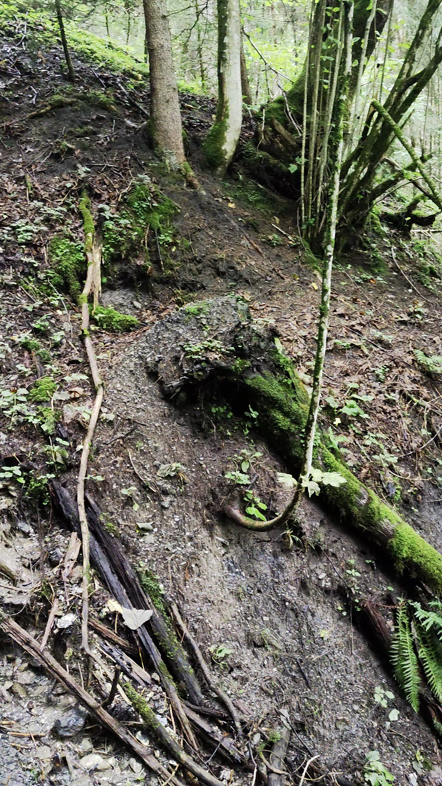
*Abb. 5: Noexif media (Aufnahmezeitpunkt: 13:46, Seehöhe: 904 m)*

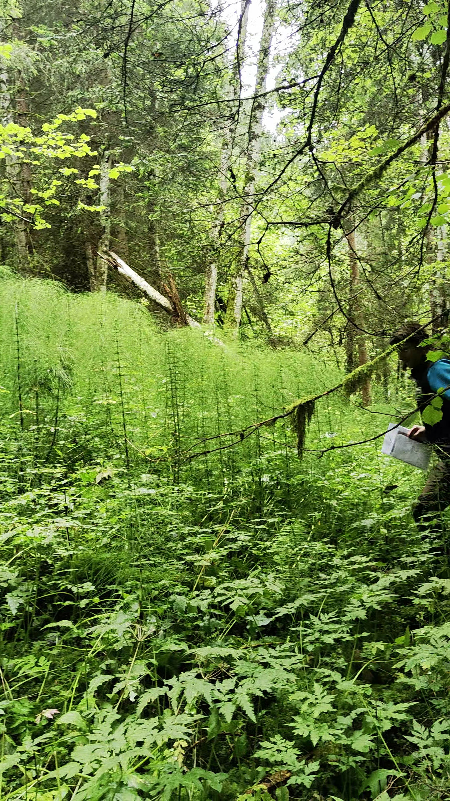
*Abb. 6: Noexif media (Aufnahmezeitpunkt: 13:57, Seehöhe: 914 m)*

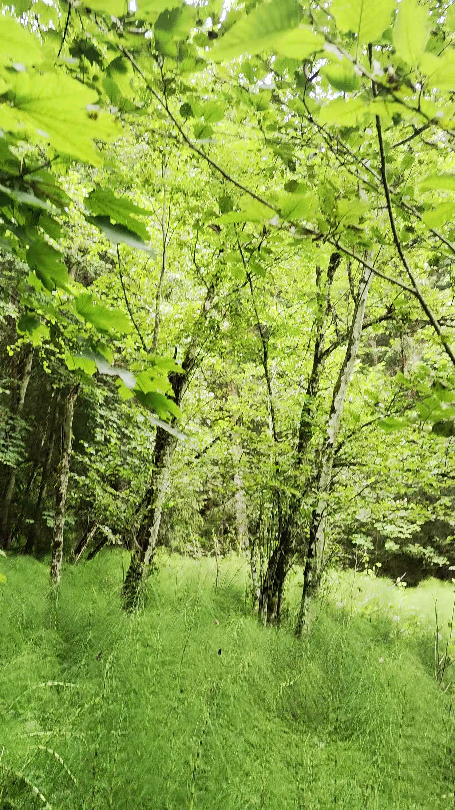
*Abb. 7: Noexif media (Aufnahmezeitpunkt: 14:02, Seehöhe: 925 m)*

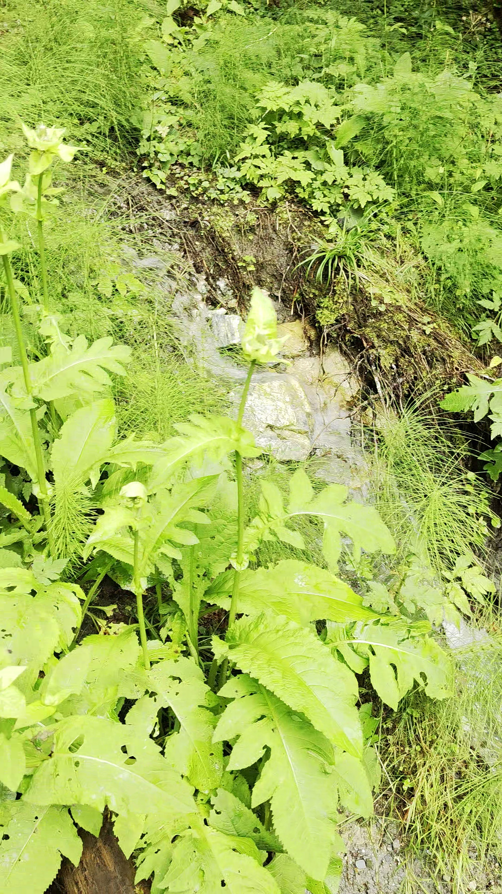
*Abb. 8: Noexif media (Aufnahmezeitpunkt: 14:04, Seehöhe: 926 m)*

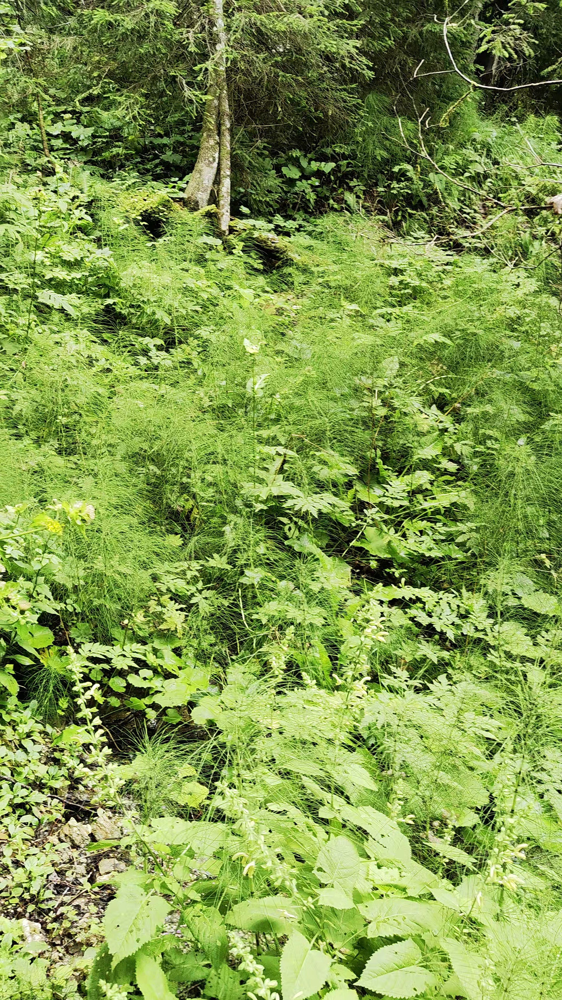
*Abb. 9: Noexif media (Aufnahmezeitpunkt: 14:05, Seehöhe: 927 m)*

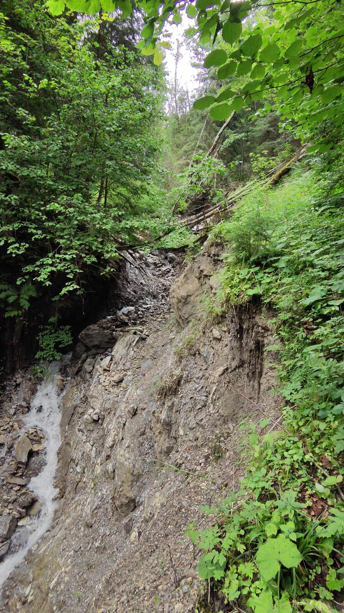
*Abb. 10: Noexif media (Aufnahmezeitpunkt: 14:09, Seehöhe: 930 m)*

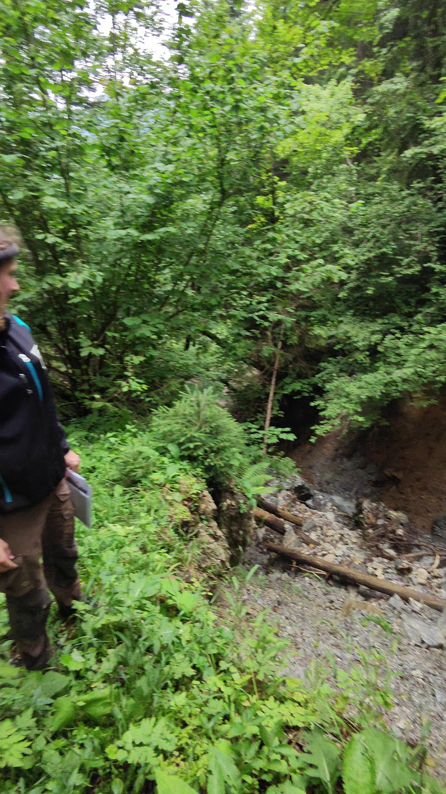
*Abb. 11: Noexif media (Aufnahmezeitpunkt: 14:10, Seehöhe: 932 m)*

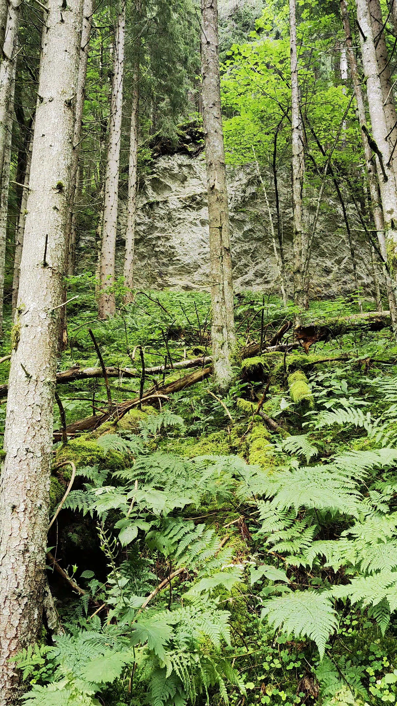
*Abb. 12: Noexif media (Aufnahmezeitpunkt: 14:15, Seehöhe: 951 m)*

*Abb. 13: Noexif media (Aufnahmezeitpunkt: 14:19, Seehöhe: 964 m)*

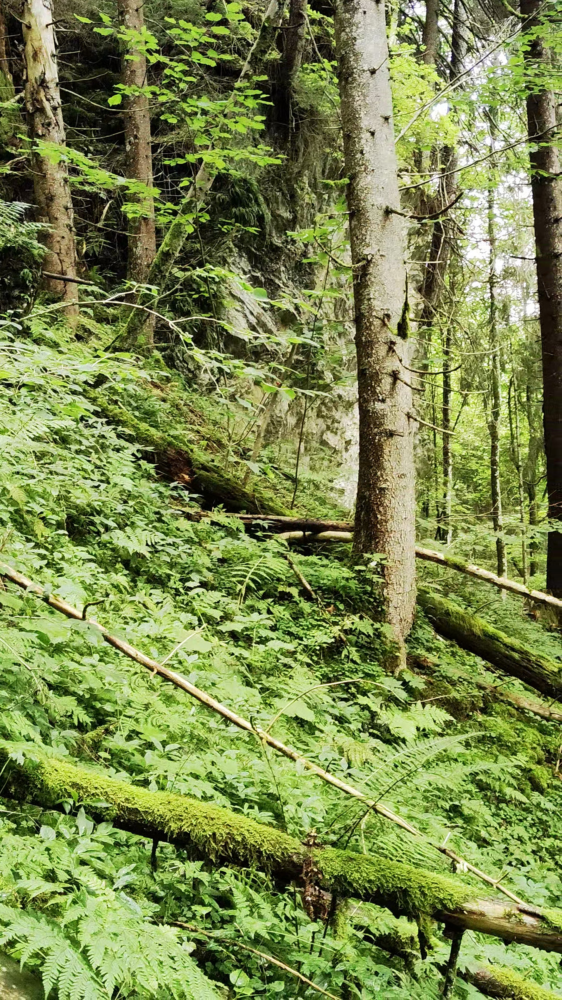
*Abb. 14: Noexif media (Aufnahmezeitpunkt: 14:20, Seehöhe: 973 m)*

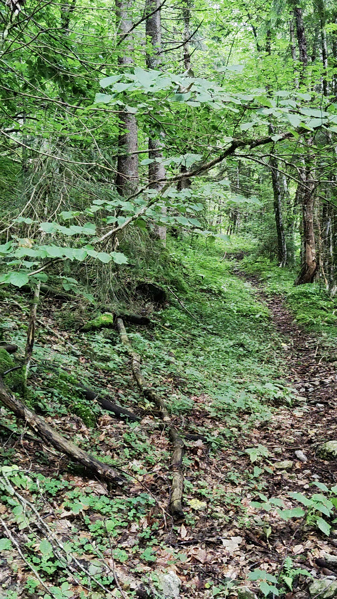
*Abb. 15: Noexif media (Aufnahmezeitpunkt: 14:25, Seehöhe: 1002 m)*

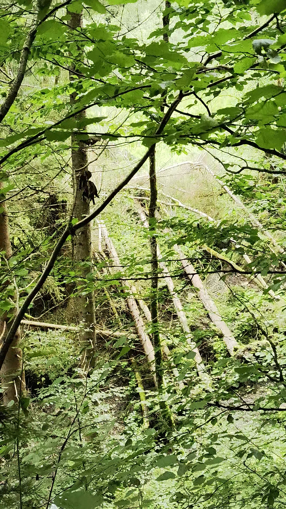
*Abb. 16: Noexif media (Aufnahmezeitpunkt: 14:26, Seehöhe: 996 m)*

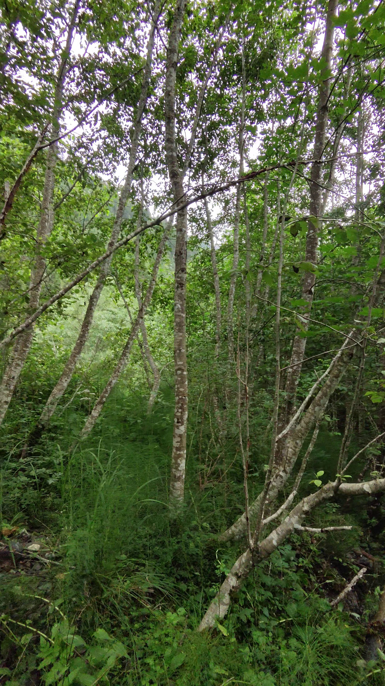
*Abb. 17: Noexif media (Aufnahmezeitpunkt: 14:29, Seehöhe: 989 m)*

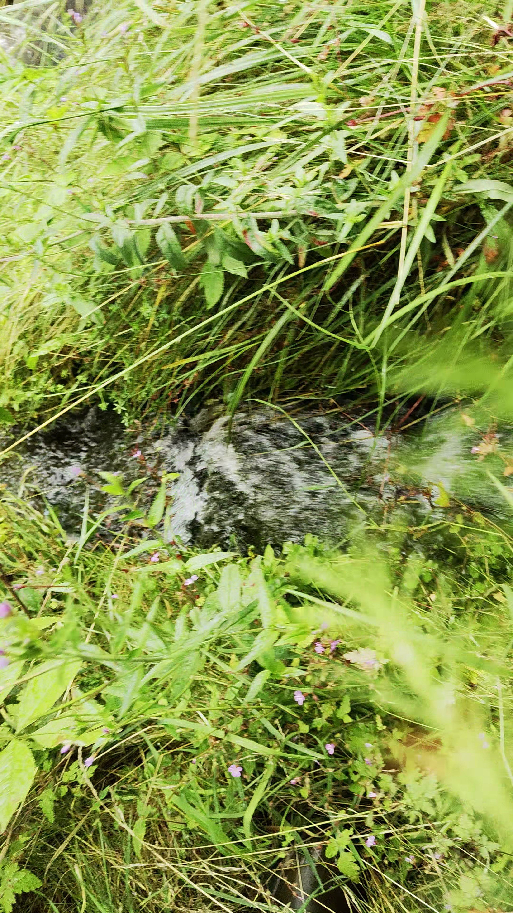
*Abb. 18: Noexif media (Aufnahmezeitpunkt: 14:50, Seehöhe: 993 m)*

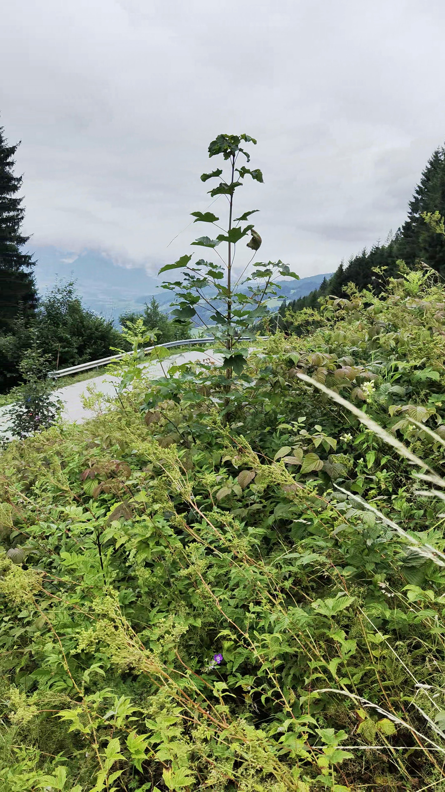
*Abb. 19: Noexif media (Aufnahmezeitpunkt: 14:52, Seehöhe: 992 m)*

## Anhänge

### Anhang A: Koordinatenliste

- Bild 1: Koordinaten nicht verfügbar
- Bild 2: 13.202193°E, 47.316853°N
- Bild 3: 13.202354°E, 47.316826°N
- Bild 4: 13.202487°E, 47.316842°N
- Bild 5: 13.202688°E, 47.316837°N
- Bild 6: 13.204042°E, 47.316487°N
- Bild 7: 13.204709°E, 47.316330°N
- Bild 8: 13.204916°E, 47.316149°N
- Bild 9: 13.204964°E, 47.316017°N
- Bild 10: 13.205115°E, 47.315670°N
- Bild 11: 13.205120°E, 47.315665°N
- Bild 12: 13.205440°E, 47.315414°N
- Bild 13: 13.205919°E, 47.315455°N
- Bild 14: 13.206002°E, 47.315370°N
- Bild 15: 13.207119°E, 47.315624°N
- Bild 16: 13.207301°E, 47.315784°N
- Bild 17: 13.207179°E, 47.316197°N
- Bild 18: 13.204694°E, 47.321295°N
- Bild 19: 13.204777°E, 47.321468°N

### Anhang B: Technische Metadaten

- **Bildformat:** .jpg
- **Koordinatenquelle:** GPS-Daten in Dateinamen  
- **Sortieralgorithmus:** Nearest Neighbor  
- **Dokumenterstellung:** Automatisch generiert
