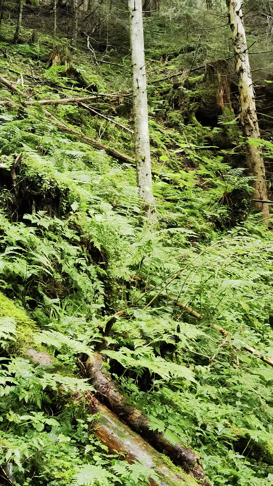

# Begehungsbericht

## Begehungsbericht

**Datum:** 16-09-2025  
**Datum der Begehung:** XX.XX.XXXX  
**Untersuchungsgebiet:** Gebiet  
**Dokumentenformat:** Begehungsbericht  
**Teilnehmende Personen:** P1, P2, ...  

## Begehungsstatistik

- **Gesamtbilder:** 11
- **Dokumentierte Strecke:** 0.86 km (Luftlinie zwischen Aufnahmepunkten)
- **Koordinatensystem:** WGS84 (GPS)

## Zielsetzung

Zielsetzung der Begehung...

## Methodik

Die Bildorganisation erfolgte automatisch nach chronologischen Kriterien. Alle Bilder werden verarbeitet, wobei Bilder ohne Zeitstempel zuerst angezeigt werden, gefolgt von Bildern mit Zeitstempel in chronologischer Reihenfolge. Die Entfernungsberechnung erfolgt mittels Haversine-Formel für präzise GPS-Distanzbestimmung zwischen aufeinanderfolgenden Aufnahmepunkten.

## Ergebnis

Ergebnisse...

## Schlussfolgerungen

Schlussfolgerungen...

# Fotodokumentation

*Abb. 1: Übersicht, grün - GPX-Track, pink - Variantenvorschlag, rote Kreise - Kontrollpunkte, rotes Polygon - zu meidende Gst, rechts der Piste - Trasse AEP-Cichini*

*Abb. 2: Noexif media (Aufnahmezeitpunkt: 14:09, Seehöhe: 930 m)*

*Abb. 3: Noexif media (Aufnahmezeitpunkt: 14:10, Seehöhe: 932 m)*

*Abb. 4: Noexif media (Aufnahmezeitpunkt: 14:15, Seehöhe: 951 m)*

*Abb. 5: Noexif media (Aufnahmezeitpunkt: 14:19, Seehöhe: 964 m)*

*Abb. 6: Noexif media (Aufnahmezeitpunkt: 14:20, Seehöhe: 973 m)*

*Abb. 7: Noexif media (Aufnahmezeitpunkt: 14:25, Seehöhe: 1002 m)*

*Abb. 8: Noexif media (Aufnahmezeitpunkt: 14:26, Seehöhe: 996 m)*

*Abb. 9: Noexif media (Aufnahmezeitpunkt: 14:29, Seehöhe: 989 m)*

*Abb. 10: Noexif media (Aufnahmezeitpunkt: 14:50, Seehöhe: 993 m)*

*Abb. 11: Noexif media (Aufnahmezeitpunkt: 14:52, Seehöhe: 992 m)*

## Anhänge

### Anhang A: Koordinatenliste

- Bild 1: Koordinaten nicht verfügbar
- Bild 2: 13.205115°E, 47.315670°N
- Bild 3: 13.205120°E, 47.315665°N
- Bild 4: 13.205440°E, 47.315414°N
- Bild 5: 13.205919°E, 47.315455°N
- Bild 6: 13.206002°E, 47.315370°N
- Bild 7: 13.207119°E, 47.315624°N
- Bild 8: 13.207301°E, 47.315784°N
- Bild 9: 13.207179°E, 47.316197°N
- Bild 10: 13.204694°E, 47.321295°N
- Bild 11: 13.204777°E, 47.321468°N

### Anhang B: Technische Metadaten

- **Bildformat:** .jpg
- **Dokumentformat:** A4 PDF
- **Koordinatenquelle:** GPS-Daten in Dateinamen  
- **Datumsquelle:** Datum und Uhrzeit in Dateinamen  
- **Sortieralgorithmus:** Chronologisch
